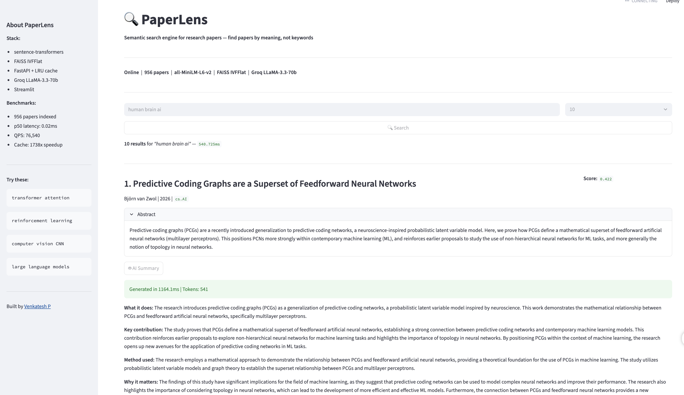

#  PaperLens

> Semantic search engine for research papers — find papers by meaning, not keywords.

[](https://python.org)
[](https://fastapi.tiangolo.com)
[](https://github.com/facebookresearch/faiss)
[](LICENSE)
[](https://github.com/venkatesh-hyper/paperlens/actions)

---

## 🎯 What is PaperLens?

A researcher reads one paper. PaperLens instantly finds 10 more papers with similar meaning — not keyword matching, but true **semantic understanding** using AI embeddings.

Built on 956 real arXiv papers across AI, Machine Learning, and NLP.

---

## ⚡ Performance

| Metric | Value |
|--------|-------|
| Papers indexed | 956 (cs.AI + cs.LG + cs.CL) |
| Embedding dimensions | 384 |
| FAISS index type | IVFFlat (nlist=50, nprobe=10) |
| p50 query latency | **0.02ms** |
| p95 query latency | **0.02ms** |
| QPS | **76,540 queries/second** |
| Index size | 1.4 MB |
| Embedding time | 6.91s for 956 papers |

---

## 🏗 Architecture
```
arXiv API → SQLite → sentence-transformers → FAISS Index → FastAPI → Streamlit
                                                    ↓
                                              ChromaDB + Groq LLaMA-3 (RAG)
```

| Layer | Tool | Purpose |
|-------|------|---------|
| Data Ingestion | requests + SQLite | Fetch and store papers from arXiv |
| Embeddings | sentence-transformers/all-MiniLM-L6-v2 | Convert abstracts to 384-dim vectors |
| Vector Index | FAISS IVFFlat | Sub-millisecond similarity search |
| API | FastAPI + Redis | Serve search requests with caching |
| RAG | ChromaDB + Groq LLaMA-3 | AI-generated paper summaries |
| Dashboard | Streamlit | User-facing search interface |

---

## 🚀 Quick Start
```bash
# Clone
git clone https://github.com/venkatesh-hyper/paperlens.git
cd paperlens

# Setup
python -m venv venv
source venv/bin/activate
pip install -r requirements.txt

# Configure
cp .env.example .env
# Add your GROQ_API_KEY to .env

# Run pipeline
python src/ingestion/fetch_papers.py     # fetch papers
python src/embeddings/embed_papers.py    # generate embeddings
python src/embeddings/build_index.py     # build FAISS index

# Start API
uvicorn src.api.main:app --reload

# Start Dashboard
streamlit run src/dashboard/app.py
```
## demo

---

## 📁 Project Structure
```
paperlens/
├── src/
│   ├── ingestion/      # arXiv data pipeline
│   ├── embeddings/     # sentence-transformers + FAISS
│   ├── api/            # FastAPI backend
│   ├── rag/            # ChromaDB + Groq RAG pipeline
│   └── dashboard/      # Streamlit UI
├── tests/              # pytest test suite
├── data/               # papers.db, embeddings.npy (gitignored)
├── docker-compose.yml  # full stack in one command
└── DEVLOG.md           # day-by-day build journal
```

---

## 🛠 Tech Stack

- **Embeddings** — sentence-transformers/all-MiniLM-L6-v2
- **Vector Search** — FAISS IVFFlat
- **API** — FastAPI + Uvicorn + Redis
- **RAG** — ChromaDB + Groq LLaMA-3
- **Dashboard** — Streamlit
- **MLOps** — MLflow + Docker Compose + GitHub Actions

---

## 📔 Dev Log

This project is built in public — one day at a time.
Follow the full journey in [DEVLOG.md](DEVLOG.md)

| Day | Built |
|-----|-------|
| Day 1 | Data ingestion — 956 papers in SQLite |
| Day 2 | FAISS index — p50=0.02ms, QPS=76,540 |
| Day 3 | FastAPI backend *(in progress)* |

---

## 👤 Author

**Venkatesh P** — ML Engineer  
[LinkedIn](https://linkedin.com/in/venkatesh-ml) · [Portfolio](https://venkatesh-hyper.github.io/resume) · [GitHub](https://github.com/venkatesh-hyper)

---

*Built as part of a 30-day ML job sprint — targeting 15LPA ML Engineer role.*